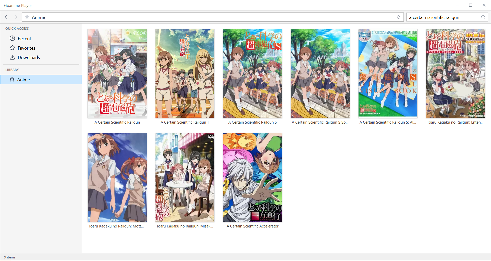
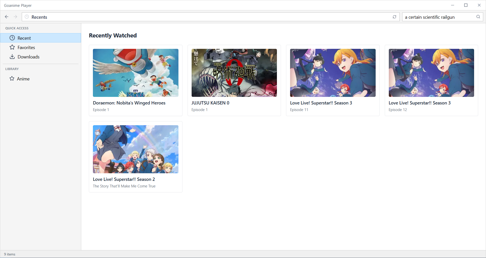
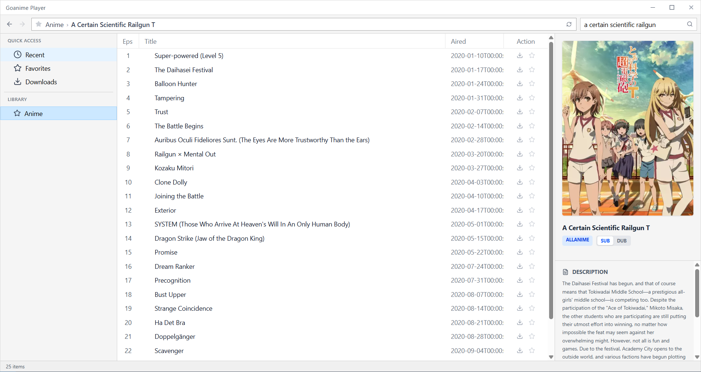
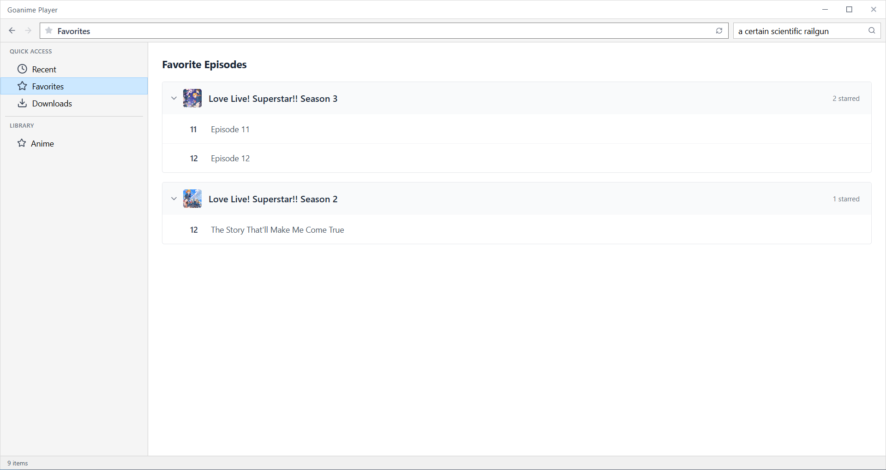

# GoAnime Player



A desktop application for streaming and downloading anime, built with Wails (Go), React, and HLS. It features a unified search interface, intelligent metadata matching, and proximity-based proxy for efficient streaming.

> [!CAUTION]
> This software is for educational purposes only. I do not take AND will not any responsibility for copyright infringement or misuse of the application. Users are responsible for complying with the terms of service of any third-party providers accessed via this software.

## Screenshots

<p align="center">
  
  
  
</p>

## Features

- **High-Performance Streaming**: Integrated proxy server with HLS support for smooth playback.
- **Dynamic Metadata**: Real-time anime details, synopsis, and high-quality artwork via MyAnimeList integration.
- **Intelligent Dub Matching**: Automatic resolution of dubbed versions for subbed entries using fuzzy-title scoring.
- **Advanced Downloads**: Multi-threaded downloader with support for HLS-to-MP4 conversion.
- **Unified Cache**: Cross-version metadata caching to prevent redundant API calls.

## Tech Stack

- **Backend**: Go 1.24+
- **Frontend**: React (TypeScript), Tailwind CSS
- **Framework**: Wails v2
- **Core Library**: Modified [GoAnime](https://github.com/alvarorichard/Goanime) (bundled in `libs/GoAnime` for custom patches)

## Development

### Prerequisites

- Go (1.24 or higher)
- Node.js (v18+)
- FFmpeg (required for download remuxing)
- [Wails CLI](https://wails.io/docs/gettingstarted/installation)

### Installation

1. Clone the repository.
2. Ensure you have the bundled library:
   ```bash
   git submodule update --init --recursive
   ```
3. Generate Go bindings and start the dev environment:
   ```bash
   wails dev
   ```

### Building

To create a production-ready Windows executable:
```bash
wails build -clean -platform windows/amd64
```

## Credits

Special thanks to [alvarorichard](https://github.com/alvarorichard) for the original GoAnime library. This project uses a modified version to handle specific scraping.

## License

This project is licensed under the MIT License - see the `libs/GoAnime/LICENSE` file for details.
